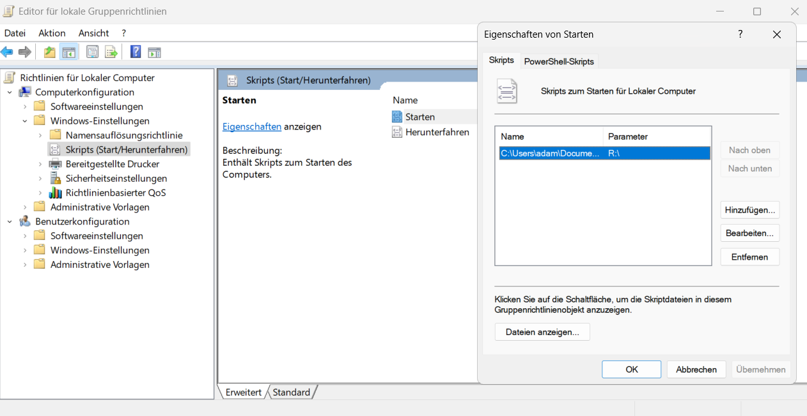

# Sammulung von Start- Shutdown Scripten

(C) 2025 Adam Skotarczak <adam@skotarczak.net> ([LICENZE](./LIZENSE))

## Skripte

[PLATZHALTER]

### [`shutdown.bat`](./scripts/shutdown.bat)

Löscht diverse tempoäre Pfade unter windows. Sollte z.B beim Shutdown eingesetzt werden:

#### Installation

`gpedit.msc → Computerkonfiguration → Windows-Einstellungen → Skripts (Herunterfahren)`  

  

#### Parameter

| Aufruf                      | Wirkung                                              |  
|-----------------------------|------------------------------------------------------|  
| `shutdown.bat`              | Führe Cleanup aus, keine Logs                        |  
| `shutdown.bat debug`        | Führe Cleanup aus + logge nach shutdownbat.log       |  
| `shutdown.bat test`         | Simuliere nur, keine Daten werden gelöscht           |  
| `shutdown.bat test debug`   | Simuliere + logge alles                              |  

### [`startup.bat`](./scripts/startup.bat)

Erstellt an einem beliebigen Pfad eine Verzeichnisebene.  

> `./startup.bat R:\`

Das Skript erstellt beim ersten Aufruf die Datei `dirlist.txt` in gleichen Veerzeichnis in dem sich das Skript befindet. Diese Datei kann bearbeitet und weitere Verzeichnise hinzugefügt werden. Mit erneutem Aufruf werden diese Verzeichnise erstellt.
